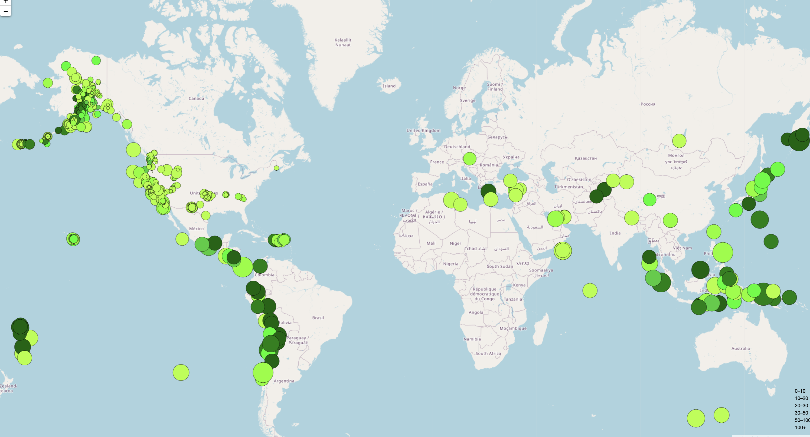

# Earthquake-Visualization
The USGS is interested in building a new set of tools that will allow them to visualize their earthquake data. They collect a massive amount of data from all over the world each day, but they lack a meaningful way of displaying it. In this challenge, I have been tasked with developing a way to visualize USGS data that will allow them to better educate the public and other government organizations (and hopefully secure more funding) on issues facing our planet.
***
# Processing

1. Get my dataset
-  Visit the USGS GeoJSON FeedLinks to an external site page(https://earthquake.usgs.gov/earthquakes/feed/v1.0/geojson.php)  and choose a dataset to visualize. -"All Earthquakes from the Past 7 Days"

2. Import and visualize the data by doing the following:
- Using Leaflet, create a map that plots all the earthquakes from my dataset based on their longitude and latitude.
- Data markers reflected the magnitude of the earthquake by their size and the depth of the earthquake by color. Earthquakes with higher magnitudes appeared larger, and earthquakes with greater depth appeared darker in color.
- Include popups that provide additional information about the earthquake when its associated marker is clicked.
- Create a legend that will provide context for your map data.

